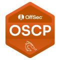

# Offensive Security Portfolio

Portfolio destiné à démontrer mes compétences pratiques en pentesting et cybersécurité offensive, avec méthodologie claire et exemples concrets d’analyses.

Pentester orienté cybersécurité offensive, certifié OSCP.
Expérience acquise via les laboratoires Offensive Security, Hack The Box
et des compétitions CTF (404CTF).

Tous les travaux présentés ici ont été réalisés **à titre strictement personnel**, dans des environnements
légaux et contrôlés (labs, CTF, machines volontairement vulnérables).

---

## 🔐 Certifications

---

## 🧪 Environnements pratiqués
- Offensive Security Labs
- Hack The Box – pratique régulière sur machines Linux/Windows et ProLabs  
  👉 Profil : https://app.hackthebox.com/public/users/2044018
- CTF : 404CTF 2025

---

## 🛠️ Compétences clés
- Web pentesting (OWASP Top 10, logique applicative)
- Attaques Active Directory
- Privilege escalation Linux & Windows
- Pivoting & réseaux segmentés
- Rédaction de rapports techniques

---

## 📂 Contenu du dépôt
- `certifications/` : détails des certifications obtenues
- `experience/` : résumé des plateformes et compétitions

⚠️ Aucun test n’a été réalisé sur des systèmes sans autorisation.

---

📌 Dépôts complémentaires :
- 🛠️ **Outils & automatisation** :  
  Offensive Security Tooling – inventaire des outils utilisés en cybersécurité offensive  
  👉 https://github.com/stephaneleduc/offensive-security-tooling
  
- 🧪 **Write-ups techniques** :  
  Chaînes d’attaque et notes techniques (accès sur demande)
  👉 https://github.com/stephaneleduc/writeups-technical

---

